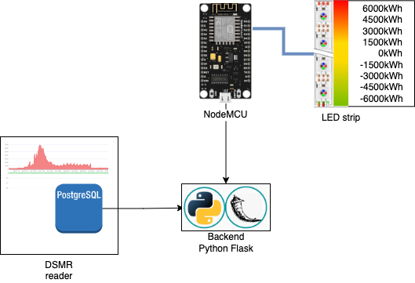

# EnergyWatcher

Live Energy Consumption monitor

## Architecture overview



## Flask backend

the Flask backend will query the postgres database that is installed using [DSMRreader](https://dsmr-reader.readthedocs.io/en/v5/#).

## Configure the database

We need to create an extra user to read the data.

```
CREATE USER energymon WITH PASSWORD 'XXXX' LOGIN;
```

Allow the new user to connect to the database.

```
GRANT CONNECT ON DATABASE dsmrreader TO energymon;
GRANT USAGE ON SCHEMA public TO energymon;
```

Allow access to query the required tables.

```
postgres=# \c dsmrreader
You are now connected to database "dsmrreader" as user "postgres".
dsmrreader=# GRANT SELECT ON dsmr_datalogger_dsmrreading TO energymon;
GRANT SELECT ON dsmr_datalogger_dsmrreading TO energymon;
```

Query to test:

```
SELECT id, electricity_currently_delivered, electricity_currently_returned  FROM public.dsmr_datalogger_dsmrreading
ORDER BY id DESC LIMIT 100
```

## Swagger definition

```
paths:
  /electricity:
    get:
      summary: Get real-time electricity consumption in kWh
  /gas:
    get:
      summary: Get real-time gas consumption in m3
```
